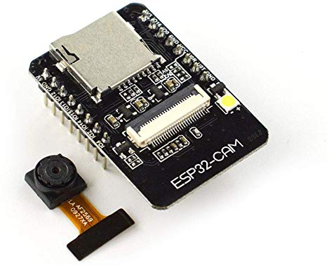
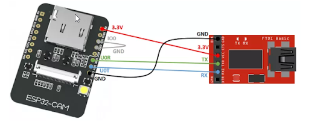

# esp32-cam-example

Simple web cam example with face recognition based on the board AI Thinker esp32-cam and [platformio.org](http://platformio.org).
This project is mainly based on the standard [CameraWebServer](https://github.com/espressif/arduino-esp32/tree/master/libraries/ESP32/examples/Camera/CameraWebServer) of the esp32 examples. 
In addition I added an ad hoc wifi network 'esp32-cam'. The streaming webpage is available under 192.168.4.1

For setting everything up and for wiring see e.g. this [tutorial](https://randomnerdtutorials.com/esp32-cam-video-streaming-face-recognition-arduino-ide/).
